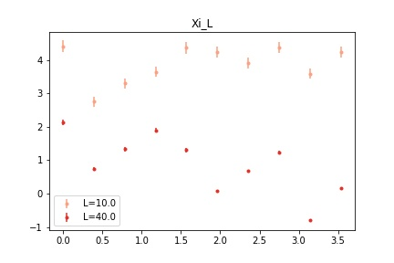

# Simulation and Analysis Code for $2D$ $\mathcal{O}(3)$ Nonlinear Sigma Model with Topological Term $\theta$

## Simulation code for Monte Carlo approach

This approach uses a conventional Monte Carlo simulation with a Metropolis step to simulate the $2D$ $\mathcal{O}(3)$ nonlinear sigma model where the topological term $\theta$ is assigned an imaginary value.

### Background and Methodology

#### Lattice Action

In the continuum, the model has action

$S = \frac{1}{2g} \int d^{2} x \left( \partial_{\mu} \vec{\phi}(x)\right)^{2} - i \theta \int d^{2} x Q(x)$

with

$Q(x) = \frac{1}{8 \pi} \epsilon^{\mu \nu} \epsilon_{abc} \partial_{\mu} \phi^{b}(x) \partial_{\nu}\phi^{c}(x)$

with $\phi$ a 3-component unit vector.

In lattice action form, we have (see B. Alles, M. Giordano, and A. Papa. Behavior near θ = π of the mass gap in the two-dimensional o(3) nonlinear sigma model. Phys. Rev. B, 90:184421, Nov 2014):

$
\begin{align}
S_{L} &=& A_{L} - i \theta Q_{L}\\
A_{L} &=& -\frac{1}{g_{L}}\sum_{x,\mu}\left(\phi_{x}\cdot \phi_{x+\hat{\mu}}\right)\\
Q_{L} &=& \sum_{x}\sum_{\Delta} Q_{L} \Delta
\end{align}
$

where $\vec{\phi}$ a 3-component unit vector ($\vec{\phi} \cdot\vec{\phi} = 1$) and $Q_{L}$ is the total topological charge on the lattice. 

#### Regularization of the topological charge

The topological charge has been defined via sums over triangles created by cutting each square plaquette along the diagonal. Each vertex is labeled (numbered counter-clockwise), such that we call the fields at the sites of the vertices $\vec{\phi}_{1}$, $\vec{\phi}_{2}$, and $\vec{\phi}_{3}$. 


The topological charge over each triangle obeys

$\exp(2 \pi i Q_{L}(\Delta)) = \frac{1}{\rho}\left(1 + \vec{\phi}_{1}\cdot\vec{\phi}_{2} + \vec{\phi}_{2}\cdot\vec{\phi}_{3} + \vec{\phi}_{3}\cdot\vec{\phi}_{1} + i \vec{\phi}_{1} \cdot (\vec{\phi}_{2}\times\vec{\phi}_{3})\right)$

with 

$\rho^{2} = 2(1+\vec{\phi}_{1}\cdot\vec{\phi}_{2})(1 + \vec{\phi}_{2}\cdot\vec{\phi}_{3})(1+ \vec{\phi}_{3}\cdot\vec{\phi}_{1})$ 

and 

$Q_{L}(\Delta) \in \left[-\frac{1}{2}, \frac{1}{2}\right]$

We use the arcsin of the quantity $\exp(2 \pi i Q_{L}(\Delta))$ to compute $Q_{L}(\Delta)$, as in C++ the domain of arcsin is symmetric about $0$, which prevents the need to adjust the domain to fit the expectation given above.

<div class="alert alert-warning">
When we sum over all unique triangles on the lattice, the total topological charge $Q_{L} = \sum_{\Delta} Q_{}(\Delta)$ should return integer values, however we are currently not finding this to be the case. More investigation is required here.
</div>

#### Analytic continuation

The simulation is run for imaginary values of $\theta$, which means we must analytically continue our results for real $\theta$. To do this, we fit our results to a curve and then substitute our imaginary $i \theta = \nu$ for a real $\theta = -i \nu$.

#### The mass gap

Our goal with this project is to determine the mass gap, which should vanish as $\theta \to \pi$. The mass gap is the inverse of the correlation length, which we compute in the simulation.

<div class="alert alert-warning">
The correlation length should be a real number, but our simulations are currently returning a complex result, due to the complexity of the correlation function. More investigation is required here.
</div>

### Running the simulation code

#### Makefile flags

The code is written in C++ and OpenMP and can be compiled with numerous flags.

```bash
USE_OMP ?= TRUE
USE_GPROF ?= FALSE
USE_TEST_PRINT_STATEMENTS ?= FALSE
USE_EXTREME_TEST_CONDITION ?= FALSE
USE_CHECK_QL_COS ?= FALSE
USE_CONST_RN ?= FALSE
```

The first flag "USE_OMP" toggles whether to implement the parallelization in the code. It should be set to "TRUE" if you want to run the simulation in parallel. This is highly recommended for large lattices as the scaling is very poor in series.

If you wish to profile the code, set the second flag "USE_GPROF" to "TRUE". This sets the correct compiler flags so that you can generate the profiling output. To view the output after the code has run, go to the directory in which you have the executable and run the command
```bash
gprof -l nonlinearsigma gmon.out > profiling_results.txt
```
You will then be able to see the profiling report. In general, you should set "USE_GPROF" to false, unless you are looking to optimize the code or troubleshoot it.

The flag "USE_TEST_PRINT_STATEMENTS" activates print statements throughout the code. This is useful for debugging, but should generally be set to FALSE as it slows down the code.

If you run into major problems, set "USE_EXTREME_TEST_CONDITION" to TRUE. This will run a testing suite built into the code, but will not run the usual simulation. This can help you identify problems in the code, and the testing suite is a function inside the main function, which can be modified as needed to add more tests.

To switch from using arcsin to calculate $Q_{L}$ to using arccos, set "USE_CHECK_QL_COS" to TRUE. In general, this should be set to FALSE< as we want to use arcsin due to its useful symmetry.

Finally, if you want to remove the random number generation and use a constant value for the random numbers, set "USE_CONST_RN" to true. This should only be done when testing the code.

#### Compiling the code

Once you have set the flags you want to use, you can compile the code by typing

```bash
make -f make_sigma
```
It can be useful to run 

```bash
make -f make_sigma clean
```
first to clear out old .o files that might not be updated otherwise.

Once you have compiled the code, you should have an executable by the name of ```nonlinearsigma``` which you will use to run the simulation.

#### Other important things to note before running the code

The simulation requires a list of parameters. We give those to the code through the text file ```inputs.txt```. That file consists of a list of parameter keywords and a value. Be very careful not to change the format of this document, only the numbers, otherwise the simulation won't be able to understand what values get assigned to what parameters. 

The file ```inputs.txt``` should look like this

```
L = 10
beta = 1.6
itheta = 1.
ntherm = 1000
nMC = 1000
freq = 100
```
Where ```L``` gives the length of the square lattice, ```beta``` is $\beta = 1/g_{L}$ and should be set to 1.6, ```itheta``` is the imaginary value given for the topological term and is given in fractions of $\pi$ (so you should enter 0.5 if you want $i \theta = \pi/2$), ```ntherm``` is the number of steps you want the simulation to take for thermalization, ```nMC``` is the number of steps in the Monte Carlo loop after thermalization, and ```freq``` sets the number of steps between saved configurations.

#### Running the code -- single job in interactive node

If you want to run this in an interactive node to test, you can request an interactive node with the following command:

```bash
salloc --cpus-per-task=1 --time=00:30:00
```
where you can adjust the number of cpus per task if you want to run the parallelized code and the time requested is in format hh:mm:ss

You can run the job using the command

```bash
./nonlinearsigma inputs.txt
```
```nonlinearsigma``` is the name of the executable created when you compiled the code, and inputs.txt is the list of inputs mentioned above. 

#### Running the code -- single SLURM submission 

Once you're comfortable with the code and want to submit a job that's longer than your interactive session (or one that may need to run overnight, etc), you do that by writing a SLURM script and sending that script to the scheduler.

The script is called ```submit_sigma.sh``` and looks like this:
```bash
#SBATCH --job-name=nonlinearsigma_omp_test           # Job name
#SBATCH --mail-type=ALL                              # Mail events (NONE, BEGIN, END, FAIL, ALL)
#SBATCH --mail-user=cberger@smith.edu                # Where to send mail
#SBATCH --partition=phyq                             # Which partition to use
#SBATCH --nodes=1                                    # Number of nodes
#SBATCH --cpus-per-task=1                           # Number of threads per task (OpenMP)
#SBATCH --mem=1gb                                    # Job memory request
##SBATCH --time=05:00:00                             # Time limit hrs:min:sec
#SBATCH --output=nonlinearsigma_omp_test_%j.log      # Standard output 
#SBATCH --error=err_nonlinearsigma_omp_test_%j.log   # Standard output and error log

pwd; hostname; date

export OMP_NUM_THREADS=$SLURM_CPUS_PER_TASK

echo "Running nonlinear sigma on single CPU core"

/usr/bin/time -v ./nonlinearsigma inputs.txt

date
```

Let's walk through what this script does.

The first line:
```bash
#SBATCH --job-name=nonlinearsigma_omp_test           # Job name
```
Assigns a name to the job, which can help you keep track of what is running in the queue. I tend to name all my jobs in a certain phase of the work the same thing (e.g. "nonlinearsigma_small_L_tests" if I'm testing out the script on small lattices or "nonlinearsigma_first_production_run" if I'm starting to take data for real). This is just for your own information, so name it whatever you'd like.

The next two lines
```bash
#SBATCH --mail-type=ALL                              # Mail events (NONE, BEGIN, END, FAIL, ALL)
#SBATCH --mail-user=cberger@smith.edu                # Where to send mail
```
tell SLURM who to email and when to email you. I have it set to email me at my Smith email anytime a job starts, ends, or fails. I find this helpful, especially if trouble arises, but it's your choice what to put here (just don't leave my email address in!).

The next line
```bash
#SBATCH --partition=phyq                             # Which partition to use
```
sends the jobs to the partition that belongs to the physics department. We have priority on this node, but we can request time on other nodes if we really need to. We'd need to talk to CATS about that if we wanted to do it.

The next lines specify the code's needs:
```bash
#SBATCH --nodes=1                                    # Number of nodes
#SBATCH --cpus-per-task=1                           # Number of threads per task (OpenMP)
#SBATCH --mem=1gb                                    # Job memory request
```
Since we are using OpenMP for parallelization, we only need one node, but we will want to change ```bash --cpus-per-task``` to something larger for OpenMP. Unless doing a very large lattice (L > 100), I tend to ask for 30 CPUs per task, which allows for 2 jobs to run at a time on each node. If you're doing something large, you might want to consider asking for 60 CPUs per task, which will occupy an entire node.

This line
```bash
##SBATCH --time=05:00:00                             # Time limit hrs:min:sec
```
sets a time limit -- it will cut off your code when that limit is reached, whether it is done or not. Note there is an extra `#` here -- that means it's commented out, so it will not have a time limit. I tend to only use the time limits when testing.

These next two lines
```bash
#SBATCH --output=nonlinearsigma_omp_test_%j.log      # Standard output 
#SBATCH --error=err_nonlinearsigma_omp_test_%j.log   # Standard output and error log
``` 
give names to the output and error files. These files are created when the code runs and can help you debug if things go wrong.

All the above were instructions for SLURM, which schedules jobs on the machine's available resources. Now we get into the commands to actually run the code.

```bash
pwd; hostname; date
```
This just prints where the job is being run from and the date and time before the job starts.

```bash
export OMP_NUM_THREADS=$SLURM_CPUS_PER_TASK
```
this sets the number of threads in OpenMP equal to the number of CPUs per task you assigned above.

```bash
echo "Running nonlinear sigma"

/usr/bin/time -v ./nonlinearsigma inputs.txt
```
This prints out an annoucement that you're starting the job, which is useful in the logfile, and then runs the simulation with the inputs file. Make sure you have the inputs file and the executable in the same folder as the SLURM script so the computer can find them.

And finally
```bash
date
```
we print the datetime stamp at the end of the simulation.

#### Running the code -- batch SLURM submissions

Each inputs file is one set of parameters, and we need to get lots of data. If you're not interested in manually setting up these SLURM scripts, input files, etc by hand, I don't blame you. That's why I wrote a Python code to do most of the work for you.

In this code, you specify what parameters you want to run, and the script creates all the appropriate directories and puts the correct inputs file, slurm script, and the executable in each directory. You still have to go in and submit the files yourself, but it's much easier than writing all these scripts yourself.

The script is called ```create_input_files.py``` and here is the part you will need to modify:

```python
#beta = 1/g = 1.6
beta = 1.6
#number of steps in thermalization
ntherm = 4000
#number of monte carlo steps
nMC = 10000
#number of steps between samples
freq = 100
#list of values for lattice length L
L_list = [10,40,80,120,180]
#list of values for itheta (as fractions of pi)
itheta_list = [0.0,0.125,0.25,0.375,0.5,0.625,0.75,0.875,1.,1.125]

script_name = "nonlinearsigma"
job_name = "nlsigma_prelim_tests"
email = "cberger@smith.edu"
num_cpus = 30

```
Beta, ntherm, nMC, and freq all take one number as input, but you can create a list of the number of lattice lengths you want, and the values for itheta (remember these are fractions of pi). 

```script_name``` is the executable, so it should be "nonlinearsigma", but ```job_name``` is what will be put in for the job name in the SLURM script. Similarly, you can enter the email address you want included in the SLURM script and choose how many CPUs you want.

Once you've modified this script to have the values you want, put it in a directory for this batch. I tend to name those something like ```run_yyymmdd```. Also in that directory should be the executable, so copy that in once you've compiled the code.

Then, inside the batch directory, go ahead and run the python script

```bash
python create_input_files.py
```

When it's done, you should see the subdirectories created -- one for each job. You need to go into each subdirectory to submit the jobs using

```bash
sbatch submit_sigma.sh
```
and it will submit the jobs to the scheduler.

You can run this with 
```bash
sbatch submit_sigma.sh
```
and you can check the status of your jobs any time with the command
```bash
squeue -u your_username
```

## Python Code for Analysis

There are a number of Jupyter Notebooks prepared to explore the data that comes out of the simulation. These are all located in the Analysis folder. There is also a Python class, LatticeData.py, which creates an analyzer object that has internal functions for analysis and visualization.

### LatticeData.py - Data Analyzer Class

#### Importing and initializing

This is a Python class. You can create a lattice data object, which then holds all the functionality you need to analyze and visualize the data. You will need to import this into your notebook like this:
```python
from LatticeData import *
```

You will want to also import the following:
* Numpy
* Pandas
* Matplotlib
* Seaborn

The simplest way to start now is by initializing the object:

``` python
analyzer = LatticeData()
```
You can now do a number of operations with this analyzer. The full list of functions is included later, but if you wanted to get all the data from that folder and put it into a Pandas dataframe, that would look like this:

```python
df = analyzer.get_data()
```

There are a number of default settings in this class, which you can change when you initialize. The defaults are:
```python
analyzer_default = LatticeData(datadir = "/data/", header = "nonlinearsigma_data",
                 dirheader = "nlsigma_data", Gheader = "Gij_avg_nonlinearsigma_data", 
                 tol = 0.00001, palette = "viridis")
```
which initializes the following internal variables:
```python

self.path = os.getcwd()+datadir #location of data
self.header = header #set the start of the filename for the data files
self.dirheader = dirheader #set the start of the data directory name from the runs
self.Gheader = Gheader #set the start of the filename for correlation function files
self.tol = tol #set the error range for parameters -- this is for filtering
self.palette = palette #option to change seaborn palette
self.observables = ['Q_L', 'A_L', 'S_L', 'Xi_L'] #observables whose expectation values can be computed
self.parameters = ["itheta", "beta", "length","nMC", "ntherm", "freq"] #parameters read in by the simulation code
```
Most of these will not need to be changed, but let's say you want to analyze a special batch of data, which you've stored in a directory called ```data_test```, and you want to use a different visualization palette, you could intialize the object like this:
```python
analyzer_special = LatticeData(datadir = "/data_test/", palette = "magma")
```
(You can choose any [seaborn palette](https://seaborn.pydata.org/tutorial/color_palettes.html) for this)

Then when you run the function
```python  
df = analyzer_special.get_data()
```
it will aggregate all the data files in the folder ```data_test```.

Below is a complete list of functions for the LatticeData class, with a brief description. While Python doesn't have the same public/private distinctions as C++, I've organized them into those same groups. Public functions are things that you may want to use. Private functions are functions that you should never need to call yourself, but are called internally.

#### Lattice Data Class Built-In Functions ("Public" or external)

##### copy_data_from_directory

```python
copy_data_from_directory(self, src_dir, dst_path = None)
```
This function loops through a specified, directory, finds any simulation directories (directions that begin with "nlsigma_data" or whatever you have specified under ```dirheader``` in your intialization), and copies the .csv files within those directories to some destination directory. The default destination directory is whatever you've specified for your data directory.
    The function requires a source directory to be passed as a string -- this is the directory where you have all your simulation results that you want copied over -- and gives you the option to specify a different destination directory using ```dst_path```)
    
If some of your simulations are not complete yet (determined by testing whether the .csv has the correct number of lines), this function will not copy those files and will print out the name of the run and how many lines there are in the data output file. For example, the folder ```run_7_18_23_stats``` contains some runs that haven't finished yet. If I try to copy the data from that directory into my data directory:
    
```python
analyzer.copy_data_from_directory("run_7_18_23_stats")
```
here's what appears printed out:
```
run L_180_beta_1.600000_itheta_0.000000_ntherm_5000_nMC_50000_freq_100 not yet complete: 378 lines
run L_180_beta_1.600000_itheta_2.356194_ntherm_5000_nMC_50000_freq_100 not yet complete: 391 lines
run L_180_beta_1.600000_itheta_3.141593_ntherm_5000_nMC_50000_freq_100 not yet complete: 237 lines
run L_180_beta_1.600000_itheta_1.570796_ntherm_5000_nMC_50000_freq_100 not yet complete: 381 lines
run L_180_beta_1.600000_itheta_0.785398_ntherm_5000_nMC_50000_freq_100 not yet complete: 240 lines
```
And those runs will not be in the data directory, while completed runs will have been copied in.

##### all_params

```python
all_params(self)
```
This function collects every unique set of parameters from your default data directory and returns it as a dataframe. It does not take any inputs -- if you want to know what combinations of parameters are in your directory, this function will tell you.
    
```python
params = analyzer.all_params()
params.head()
```
```
>
    freq	nMC	ntherm	itheta	beta	length
0	100.0	50000.0	5000.0	0.785398	1.6	20.0
1	100.0	50000.0	5000.0	0.000000	1.6	80.0
2	100.0	50000.0	5000.0	0.000000	1.6	20.0
3	100.0	50000.0	5000.0	1.570796	1.6	40.0
4	100.0	50000.0	5000.0	2.356194	1.6	10.0
```


If you want to collect data from more than one run, you can do this by only specifying which parameters you want in your dataframe, and the function will filter the data accordingly.

```python
param_dict = {"length": 10, "itheta":2.356194}
filtered_data = analyzer.get_data(single_run = False, suppress_output = True, **param_dict)
```

If you want *all* the data, just leave out the parameter dictionary entirely and it won't filter anything.

```python
all_data = analyzer.get_data(single_run = False, suppress_output = True)
```

NOTE: I strongly recommend suppressing output if you are collecting more than 2 or 3 runs, as it will slow the program down and produce a flood of output.

##### get_data

```python
get_data(self, single_run = False, corr = False, suppress_output = True, **kwargs)
```

This function will collect raw data from one or more runs and return it as a Pandas dataframe. 

If you want to just get data from one simulation run (e.g. to check thermalization or autocorrelation), you should set ```single_run``` to ``` True```. If you want the correlation function data from that run, you should set ```corr``` to ```True``` -- otherwise it will return the observable data. If you want it to print out the parameter sets it's putting into the dataset, set ```suppress_output``` to ```False```

You then need to specify what the parameters are for the run you want to see. You do this by creating a dictionary. When selecting a single one, you must ensure your dictionary has *all* the parameter values specified. The keys for these values are:
* "length": length of the lattice in each direction
* "itheta": value of the imaginary value used for theta -- actual number here, not an integer multiple of pi, but you can always use ```np.pi``` to specify it
* "beta": for our purposes this will always be 1.6, but you need to specify it anyway
* "nMC": number of steps in the Monte Carlo loop 
* "ntherm": number of steps in the thermalization loop
* "freq": frequency with which the configurations were saved

If you forget one of these, the function will remind you: 

```python
param_dict = {"length": 10, "freq": 100, "itheta":2.356194, "beta":1.6, "nMC":50000}
one_run = analyzer.get_data(single_run = True, suppress_output = False, **param_dict)

```
```
Missing parameters in input: 
['ntherm']
```
So you know now to add in the "ntherm" you're looking for. Now it should work:
```python
param_dict = {"length": 10, "freq": 100, "itheta":2.356194, "beta":1.6, "nMC":50000, "ntherm": 5000}
one_run = analyzer.get_data(single_run = True, suppress_output = False, **param_dict)
```
```
freq 100
nMC 50000
ntherm 5000
itheta 2.356194
beta 1.6
length 10
```

```python
one_run.head(3)
```
```
	step	|phi|	Q_L	A_L	S_L	Xi_L	F_LRe	F_LIm	acc	dt	...	Q_L_ta	A_L_ta	S_L_ta	Xi_L_ta	corr_length_Re	corr_length_Im	F_Re_py	F_Im_py	mass_gap_Re	mass_gap_Im
0	0	100.0	0.479179	-183.166830	-184.295868	45.724903	3.675149	8.145972	0.240000	0.0	...	1	3	3	4	8.966957	-3.640801	0.916337	0.890996	0.095738	0.038872
1	100	100.0	0.159302	-195.846927	-196.222275	62.369185	3.675149	8.145972	0.203762	0.0	...	1	3	3	4	10.472580	-4.252121	0.916337	0.890996	0.081974	0.033283
2	200	100.0	0.000000	-199.012224	-199.012224	48.119359	3.675149	8.145972	0.207164	0.0	...	1	3	3	4	9.198745	-3.734913	0.916337	0.890996	0.093325	0.037892
3	300	100.0	0.312655	-179.261053	-179.997729	46.124447	3.675149	8.145972	0.205681	0.0	...	1	3	3	4	9.006048	-3.656673	0.916337	0.890996	0.095322	0.038703
```

##### do_stats

```python 
do_stats(self, therm = 0., stack = False, **kwargs)
```
This function collects data from the directory you specified when you initialized the object. If you want to filter the data by parameters, you just need to enter a parameter dictionary just like when using get_data() above, and it will filter to include only data that matches the parameter values you've entered.

Once all the raw data is collected, it will perform some basic statistical analysis. All observables will have a mean and standard error calculated from data after thermalization. If you need to change the thermalization point, you can increase it by changing the ```therm``` argument in the function -- give it the fractional value of the data you want it to drop from the beginning of the dataset. So for example, if you have a run with ```nMC = 1000``` and ```freq = 10```, you will have a total of 100 steps in your dataset. If you set ```therm = 0.2```, it will drop the first 20 steps before computing the mean and standard error.

After calculating means and standard errors, it also computes the autocorrelation time (the step at which the observable's autocorrelation value drops below 0.3), and then determines how long that run took to complete, saving that information in seconds, minutes, and hours.

It saves all of this along with the parameters used in that run. The result is a very comprehensive dataframe. Here's an example of it run on a data directory with 25 runs in it:

```python
df_stats = analyzer.do_stats()
df_stats.info()
```
```
<class 'pandas.core.frame.DataFrame'>
RangeIndex: 25 entries, 0 to 24
Data columns (total 41 columns):
 #   Column               Non-Null Count  Dtype  
---  ------               --------------  -----  
 0   length               25 non-null     float64
 1   itheta               25 non-null     float64
 2   beta                 25 non-null     float64
 3   nMC                  25 non-null     float64
 4   ntherm               25 non-null     float64
 5   freq                 25 non-null     float64
 6   |phi|_mean           25 non-null     float64
 7   Q_L_mean             25 non-null     float64
 8   A_L_mean             25 non-null     float64
 9   S_L_mean             25 non-null     float64
 10  Xi_L_mean            25 non-null     float64
 11  F_LRe_mean           25 non-null     float64
 12  F_LIm_mean           25 non-null     float64
 13  acc_mean             25 non-null     float64
 14  Q_L_ta               25 non-null     float64
 15  A_L_ta               25 non-null     float64
 16  S_L_ta               25 non-null     float64
 17  Xi_L_ta              25 non-null     float64
 18  corr_length_Re_mean  25 non-null     float64
 19  corr_length_Im_mean  25 non-null     float64
 20  F_Re_py_mean         25 non-null     float64
 21  F_Im_py_mean         25 non-null     float64
 22  mass_gap_Re_mean     25 non-null     float64
 23  mass_gap_Im_mean     25 non-null     float64
 24  |phi|_std            25 non-null     float64
 25  Q_L_std              25 non-null     float64
 26  A_L_std              25 non-null     float64
 27  S_L_std              25 non-null     float64
 28  Xi_L_std             25 non-null     float64
 29  F_LRe_std            25 non-null     float64
 30  F_LIm_std            25 non-null     float64
 31  acc_std              25 non-null     float64
 32  corr_length_Re_std   25 non-null     float64
 33  corr_length_Im_std   25 non-null     float64
 34  F_Re_py_std          25 non-null     float64
 35  F_Im_py_std          25 non-null     float64
 36  mass_gap_Re_std      25 non-null     float64
 37  mass_gap_Im_std      25 non-null     float64
 38  time (sec)           25 non-null     float64
 39  time (min)           25 non-null     float64
 40  time (hr)            25 non-null     float64
dtypes: float64(41)
memory usage: 8.1 KB

```

If I only want the analyzed data for runs where the lattice had a length of 20, I could modify this as follows:

```python
df_stats = analyzer.do_stats(**{"length":20})
df_stats.info()
```
```
<class 'pandas.core.frame.DataFrame'>
RangeIndex: 5 entries, 0 to 4
Data columns (total 41 columns):
 #   Column               Non-Null Count  Dtype  
---  ------               --------------  -----  
 0   length               5 non-null      float64
 1   itheta               5 non-null      float64
 2   beta                 5 non-null      float64
 3   nMC                  5 non-null      float64
 4   ntherm               5 non-null      float64
 5   freq                 5 non-null      float64
 6   |phi|_mean           5 non-null      float64
 7   Q_L_mean             5 non-null      float64
 8   A_L_mean             5 non-null      float64
 9   S_L_mean             5 non-null      float64
 10  Xi_L_mean            5 non-null      float64
 11  F_LRe_mean           5 non-null      float64
 12  F_LIm_mean           5 non-null      float64
 13  acc_mean             5 non-null      float64
 14  Q_L_ta               5 non-null      float64
 15  A_L_ta               5 non-null      float64
 16  S_L_ta               5 non-null      float64
 17  Xi_L_ta              5 non-null      float64
 18  corr_length_Re_mean  5 non-null      float64
 19  corr_length_Im_mean  5 non-null      float64
 20  F_Re_py_mean         5 non-null      float64
 21  F_Im_py_mean         5 non-null      float64
 22  mass_gap_Re_mean     5 non-null      float64
 23  mass_gap_Im_mean     5 non-null      float64
 24  |phi|_std            5 non-null      float64
 25  Q_L_std              5 non-null      float64
 26  A_L_std              5 non-null      float64
 27  S_L_std              5 non-null      float64
 28  Xi_L_std             5 non-null      float64
 29  F_LRe_std            5 non-null      float64
 30  F_LIm_std            5 non-null      float64
 31  acc_std              5 non-null      float64
 32  corr_length_Re_std   5 non-null      float64
 33  corr_length_Im_std   5 non-null      float64
 34  F_Re_py_std          5 non-null      float64
 35  F_Im_py_std          5 non-null      float64
 36  mass_gap_Re_std      5 non-null      float64
 37  mass_gap_Im_std      5 non-null      float64
 38  time (sec)           5 non-null      float64
 39  time (min)           5 non-null      float64
 40  time (hr)            5 non-null      float64
dtypes: float64(41)
memory usage: 1.7 KB
```
Notice we now only have 5 entries in our dataframe, not 25. We can check that this worked:

```python
df_stats["length"].unique()
```
```
array([20.])
```

If you want the data returned using Pandas MultiIndex, set ```stack``` to ```True```, but MultiIndex doesn't always play well with seaborn and other plotting tools, so the default is ```False```.

##### get_plot_data

```python
get_plot_data(self, df, obs = "Q_L", L = 10, beta = 1.6, nMC = 10000, ntherm = 1000, freq = 100, stack = False)
```
This function allows you to get the analyzed data for one observable (you may specify which one, but the default is ```Q_L```) as a function of itheta in order to plot it. You must specify a single value for all other parameters (```L```, ```beta```, ```nMC```, ```ntherm```, ```freq```) or leave them blank to use the defaults.

This pulls its data from the internally stored dataframe self.df_stats, which is created when you run the do_stats function. If you have not run that function yet, it will do it for you, with the default settings of ```therm = 0.0``` and ```stack = False```.

<div class="alert alert-warning">
This doesn't play nice with MultiIndex right now, so I recommend making sure to do this with the default of 
   
```python
stack = False
```
</div> 

This function could be modified in order to choose your independent variable, but right now all the plots we are interested in are functions of itheta, so it's unneccesary to plot the observable as a function of any other parameter. Seaborn can be used with the raw data to study systematic effects or other things that may be functions of ```nMC```, ```ntherm``` or ```L```. 

This returns three items: x, y, and y_err, which can then be plotted immediately with the matplotlib errorbar function.

For example, if you wanted to plot ```Q_L``` as a function of ```itheta``` for all the different lengths you have in your data, you would do the following:

```python
params = analyzer.all_params()
lengths = params["length"].unique()
colors = sns.color_palette("Blues", len(lengths))
observable = "Q_L"

for n,length in enumerate(lengths):
    x,y,err = analyzer.get_plot_data(obs = observable, L = length, beta = 1.6, nMC = 50000, 
                                     ntherm = 5000, freq = 100)
    plt.errorbar(x, y , yerr = err, marker = ".", ls = "none", color = colors[n], label ="L="+str(length))
plt.legend()
plt.title(observable)
plt.show()
```
And you would get the following output:


And if you wanted to plot the magnetic susceptibility ```Xi_L``` as a function of ```itheta``` for each length, you would do:

```python
params = analyzer.all_params()
lengths = params["length"].unique()
colors = sns.color_palette("Reds", len(lengths))
observable = "Xi_L"

for n,length in enumerate(lengths):
    x,y,err = analyzer.get_plot_data(obs = observable, L = length, beta = 1.6, nMC = 50000, 
                                     ntherm = 5000, freq = 100)
    plt.errorbar(x, y , yerr = err, marker = ".", ls = "none", color = colors[n], label ="L="+str(length))
plt.legend()
plt.title(observable)
plt.show()
```
And you would get the following output:



##### get_corr_func

```python
get_corr_func(self,suppress_output = False,**kwargs)
```

This function returns the average correlation function for the set of parameters specified. This requires returning one single run, so it plays by the same rules as ```get_data``` with ```single_run = True``` and it will tell you if you left out a parameter:

```python
itheta = np.pi
beta = 1.6
length = 20
nMC = 50000
corr_params = {"itheta": itheta, "beta": beta,"length": length,"nMC": nMC}
G_ij = analyzer.get_corr_func(suppress_output = False, **corr_params)
```

```
Missing parameters in input: 
['ntherm', 'freq']

```
When you specify the complete set of parameters, it returns a 2D numpy array that represents the average correlation function on each lattice site. You can then plot this with imshow:
```python
plt.imshow(G_ij, cmap = "viridis", aspect='equal')
plt.colorbar()
plt.title("Correlation function for L = "+str(corr_params["length"])+", itheta = "+str(corr_params["itheta"]))
plt.show()

```
and you will get something that looks like this:


<div class="alert alert-warning">
Currently, the simulation returns the average value of the correlation function computed after thermalization. There is no way to change this after the simulation is run, and we don't have the code set up yet to return any error on the correlation function. That may come in future versions of the code.
</div> 

#### Lattice Data Class Built-In Functions ("Private" or internal)

##### calc_F

```python
calc_F(self, **kwargs)
```

### Analysis Notebooks

#### AnalysisTesting.ipynb

#### PhiDist.ipynb

#### DataComparison.ipynb

#### SystematicsAndTiming.ipynb

#### CorrelationFunction.ipynb

#### Observables.ipynb

## Summary of Preliminary Results

## Current issues and open questions

Issues we are working on resolving:
* The topological charge calculation ($Q_{L}$) is currently returning non-integer values
* The correlation function at the smallest nonzero lattice momentum $2\pi/L$ is a complex number, therefore so is our correlation length. Correlation length at imaginary $\theta$ should be real 
* Currently, the simulation returns the average value of the correlation function computed after thermalization. There is no way to change this after the simulation is run, and we don't have the code set up yet to return any error on the correlation function. That may come in future versions of the code.

Research questions and next steps
* What can a ML model learn from the configuration data we have so far?
* How will Complex Langevin results differ from these if at all?


```python

```
